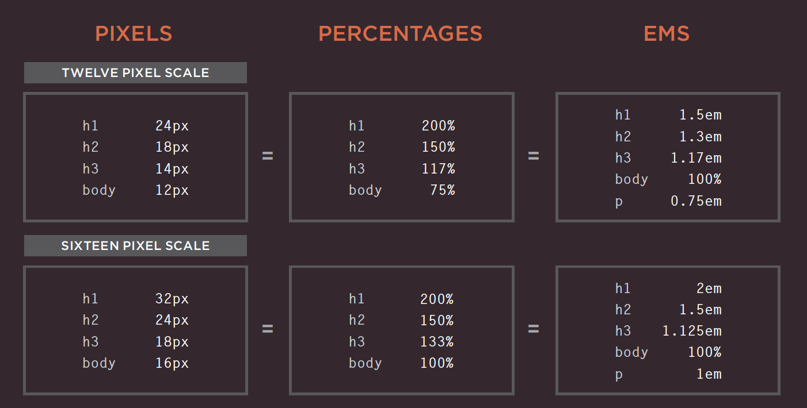

# HTML Images; CSS Color & Text Notes

## Chapter 5: Images (pp.94-125)

To add an image into your page, you should use the ``, `src`m `alt`, and `title` elements. You must ALWAYS specify a source and alt attribute.

You should save images at the size you will be using them on the webpage and in the appropriate format.

* `` element: an empty element used to add images to your page
* `src`: tells the browser where it can find the image file
* `alt`: provides text description of the image
* `title`: provide additional information about the image (not mandatory)
* height and width: size of image in pixels. Images take longer than the html code to load
* Photos are best saved as JPEGs
* Illustrations or logos that use flat colors are better saved as GIFs

### Where to place your code

1. Before a paragraph
2. Inside the start of a paragraph
3. In the middle of a paragraph

## Chapter 11: “Color” (pp.246-263)

Color helps convey the mood of your site, evoke reactions and gives your site life. It is important to ensure that there is enough contrast between any text and the packground color so that the viewer can read your text. If text is reversed out (a light color on a dark background), you can increase the height between lines and the weight of the font to make it easier to read

**RGB Values**: red, green and blue (Ex: 100,100,90)

**HEX Codes**: six-digit codes that represent the RGB (Ex: #ee3e80)

**Color Names**: 147 predefined color names recognized by browsers

**RGBA**: CSS3 introduced an extra value for RGB colors to indicate opacity

**HSL Colors** hue, saturation and lightness values

**HSLA**: (A=Alpha) CSS3 introduced an optional opacity value when you specify colors as HSL values

**Hue**: is similar to the idea of color. This is extressed as an angle (between 0 and 360 degrees)

**Saturation**: refers to the amount of gray in a color and is expressed as a percentage

**Brightness**: refers to how much black is in a color (not the same as lightness)

**Lightness**: sometimes refered to as luminosity,is the amount of white or black is in a color and is represented as a percentage (0%=black, 100%=white, 50%=normal)

## Chapter 12: “Text” (pp.264-299)

* There are properties to control the choice of font, size, weight, style, and spacing.
* There is a limited choice of fonts that you can assume most people have installed
* If you want to use a wider range of typefaces you need to have the right license to use them
* You can control the space between lines of text, individual letter and words
* Text can also be aligned to the left right, center, or justified
* Text can be indented
* You can use pseudo-classes to change the style of an element when a user hovers over or clicks on the text

### Units of Type Size

The default size of a text in a broswer is 16 px
Percentages or ems calculate the size of text you want based on the default size of text used in the browser.

### Typeface Terminology

* **Serif fonts**: extra details on the ends of the main strokes of the letter — traditionally used for long text passages in print materials
* **Sans-serif fonts**: straight ends creating a cleaner design — if texts are small, sans-serif fonts are easier to read on screens because of the lower resolution compared to that of print 
* **Monospace fonts**: also known as fixed-width, where every letter within the font is the same width — commonly used for code because they align nicely
* **Cursive fonts**: either have joining strokes or other cursive characteristics
* **Fantasy fonts**: usually decorative fonts and are often used for titles
* **Weight**: (light, medium, bold and black) adds emphasis and affects the amouny of white space and contrast on a page
* **Style**: normal, italic, oblique
* **Italic**: add a cursive aspect to some of the lettering
* **Oblique**: angled version of the normal style
* **Stretch**: condensed, regular and extended
* **Condensed**: (narrow) letters are thinner and closer together
* **Extended**: letters are thicker and further apart
* **Alignment**: (left, right, center, justify) allows you to control the alignment of text
* **Justify**: indicates that every line in a paragraph, except the last line should take up the full width of the containing box
* **Vertical alignment**: used with inline elements (baseline, sub, super, top, text-top, middle, bottom, text-bottom, length)
* **Psuedo elements**: acts like an extra element in the code
* **Psuedo class**: acts like an extra value for a class attribute

## [JPEG vs PNG vs GIF — which image format to use and when?](https://blog.imagekit.io/jpeg-vs-png-vs-gif-which-image-format-to-use-and-when-c8913ae3e01d) 
Written by Rahul Nanwani

### Compression

* **Lossless compression**: possible to reconstruct the original image
* **Lossy compression**: irreversible

### When to use JPEG

* photos of natural images where there is variation in colour and the intensity it smooth
* does not support transparency
* a lossy compression
* supports around 16 million colors

### When to use PNG

* images, objects and logos that need to be transparent or have sharp contrast edges
* a lossless compression
* PNG8 can support up to 256 colors
* PNG24 can support up to 16 million

### When to use GIF

* images that contain animations and movement
* GIF is a lossless image that uses LZW compression algorithm
* supports transparency, but not partial transparency
* limited to 256 colors
